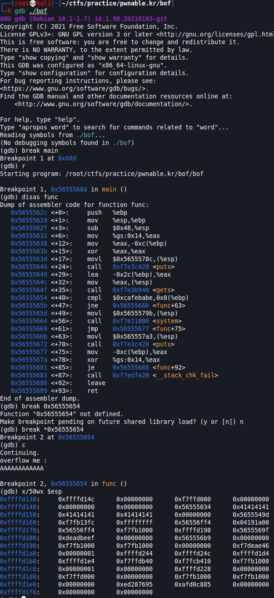

# bof
```
Nana told me that buffer overflow is one of the most common software vulnerability. 
Is that true?

Download : http://pwnable.kr/bin/bof
Download : http://pwnable.kr/bin/bof.c

Running at : nc pwnable.kr 9000
```

```c
#include <stdio.h>
#include <string.h>
#include <stdlib.h>
void func(int key){
	char overflowme[32];
	printf("overflow me : ");
	gets(overflowme);	// smash me!
	if(key == 0xcafebabe){
		system("/bin/sh");
	}
	else{
		printf("Nah..\n");
	}
}
int main(int argc, char* argv[]){
	func(0xdeadbeef);
	return 0;
}

```

Insecure `get()` function in c. Clearly we need to overflow `overflowme` variable to overwrite `key`.
The tricky point here is to find the offset before the `key`.

We can do this using gdb.

  

First set a breakpoint at `main()` function to locate the compare instruction `cmpl`. In this case, it is `0x56555654`.

Then set a breakpoint at `0x56555654` and see the stacks using `x/50wx $esp`.

We can see that from the beginning of our input `0x41414141...` to `0xdeadbeef` is 52 bytes.

So we can input `'A'*52 + '0xcafebabe'` to the program and it will give us a shell.

